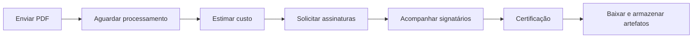

# @assinafy/cli

*Português · [Read in English](README.en.md)*

A CLI e o SDK Node.js da [API Assinafy](https://api.assinafy.com.br/v1/docs) permitem enviar PDFs, cadastrar signatários, solicitar assinaturas, acompanhar o processamento e baixar documentos certificados. O pacote inclui um executável para terminal e um SDK TypeScript em `@assinafy/cli/api`, com acesso às 93 operações publicadas.

Este guia segue o fluxo de uma integração: instalação, autenticação, envio, assinatura e armazenamento do resultado. A [referência do SDK](docs/sdk-reference.md) documenta cada método; a [referência HTTP](docs/api-reference.md) contém os parâmetros e os payloads completos de requisição e resposta publicados pela Assinafy.

## Conteúdo

1. [Requisitos e instalação](#requisitos-e-instalação)
2. [Escolha da autenticação](#escolha-da-autenticação)
3. [Configuração e ambientes](#configuração-e-ambientes)
4. [Primeiro envio](#primeiro-envio)
5. [Fluxo completo do documento](#fluxo-completo-do-documento)
6. [Verificação, ordem e templates](#verificação-ordem-e-templates)
7. [Fluxo do signatário](#fluxo-do-signatário)
8. [Eventos e webhooks](#eventos-e-webhooks)
9. [SDK Node.js](#sdk-nodejs)
10. [Saída, erros e automação](#saída-erros-e-automação)
11. [Referência de comandos](#referência-de-comandos)
12. [Desenvolvimento e publicação](#desenvolvimento-e-publicação)

## Requisitos e instalação

Use [Node.js 24 LTS](https://nodejs.org/en/about/previous-releases) atualizado. O mínimo suportado é `22.12.0`; a CI também verifica as linhas 22 e 26. A CLI funciona em Linux, macOS e Windows, em x64 e ARM64. Os arquivos de release incluem o executável JavaScript e exigem Node.js instalado.

Instale uma versão publicada e fixe essa versão nas automações:

```bash
npm install -g @assinafy/cli@<versão>
assinafy --version
assinafy --help
```

Para usar somente o SDK em uma aplicação:

```bash
npm install @assinafy/cli@<versão>
```

Também é possível executar `npx @assinafy/cli@<versão> --help`. Substitua os valores entre `<...>` pela versão ou pelos identificadores da sua integração. Os endereços `example.com`, IDs e telefones dos exemplos são fictícios.

### Instalação por release

Baixe e leia o instalador da mesma tag que deseja instalar:

```bash
ASSINAFY_VERSION=vX.Y.Z
curl -fsSLo assinafy-install.sh \
  "https://raw.githubusercontent.com/assinafy/assinafy-cli/${ASSINAFY_VERSION}/install.sh"
less assinafy-install.sh
bash assinafy-install.sh "$ASSINAFY_VERSION"
```

No PowerShell:

```powershell
$Version = 'vX.Y.Z'
Invoke-WebRequest "https://raw.githubusercontent.com/assinafy/assinafy-cli/$Version/install.ps1" -OutFile .\assinafy-install.ps1
Get-Content .\assinafy-install.ps1
& .\assinafy-install.ps1 -Version $Version
```

O instalador verifica o arquivo contra o `SHA256SUMS` do release e confirma a versão antes de substituir o executável. O destino padrão é `~/.assinafy/bin`; a documentação acompanha a instalação em `~/.assinafy/docs`. Defina `ASSINAFY_INSTALL` para outro diretório ou `ASSINAFY_NO_PATH_UPDATE=1` para gerenciar o `PATH` manualmente.

## Escolha da autenticação

| Credencial | Transporte | Uso |
| --- | --- | --- |
| Chave de API | `X-Api-Key` | Integrações diretas do proprietário da conta. |
| Access token OAuth | `Authorization: Bearer` | Aplicativos de marketplace, com consentimento, escopos e um workspace por conexão. |
| JWT de usuário | `Authorization: Bearer` | Sessões obtidas por login e operações de usuário permitidas pela API. |
| Código do signatário | `signer-access-code` na query | Operações da pessoa que assina, a partir do convite. |

### Integração direta

Gere sua chave no painel Assinafy e salve uma configuração local:

```bash
assinafy login
assinafy whoami
```

`login` solicita a chave e o ID do workspace. `whoami` lista os workspaces acessíveis e confirma a credencial e a URL base. Verifique se o workspace selecionado aparece nessa lista; `whoami` não valida automaticamente o ID padrão configurado.

`auth login user@example.com` inicia uma sessão de usuário. `auth api-keys create` gera e rotaciona a chave dessa conta; use esse comando apenas quando essa rotação fizer parte do seu fluxo. Prefira prompts protegidos e variáveis de ambiente a segredos em argumentos.

### Aplicativos OAuth

A CLI já inclui o ID público da aplicação oficial e usa PKCE S256, sem segredo de cliente. O retorno automático usa esta URI HTTPS exata, sem extensão nem barra final, servida pelo projeto `integrations-generic-callback`:

```text
https://integrations.assinafy.com.br/assinafy-cli/oauth-callback
```

A CLI solicita os nove escopos `account:read documents:read documents:write templates:read templates:write openid profile email offline_access` por padrão, incluindo leitura e alteração de templates. O cadastro da aplicação deve permitir os nove; uma conexão existente precisa de novo consentimento para obter permissões adicionais. `--scope` permite solicitar um conjunto menor explicitamente.

Não é necessário configurar `ASSINAFY_OAUTH_CLIENT_ID` para usar a aplicação oficial. Para uma aplicação própria ou outro ambiente, use `--client-id` ou essa variável; a flag tem precedência. A aplicação escolhida precisa ter a URI de retorno e os escopos cadastrados. Em um diretório privado fora do repositório:

```bash
umask 077
assinafy oauth connect --json > tokens.json
unset ASSINAFY_API_KEY
export ASSINAFY_TOKEN="$(jq -er '.access_token' tokens.json)"
assinafy workspaces list --json
```

A CLI abre o navegador e aguarda o consentimento. A página HTTPS encaminha a resposta para uma porta temporária em `127.0.0.1`; a CLI valida `state` e o emissor, fecha a porta e troca o código usando o verificador PKCE mantido localmente. Não é necessário copiar um código. Use o navegador no mesmo computador da CLI. O site recebe a resposta de autorização; a troca de tokens ocorre diretamente entre a CLI e a Assinafy.

As telas de retorno usam a identidade visual de `integrations.assinafy.com.br` e distinguem resposta recebida, autorização não concluída e retorno inválido. Confira o resultado final no terminal. Se aparecer `invalid_scope`, verifique as permissões cadastradas para a aplicação, incluindo `offline_access`.

`--no-browser` permite abrir manualmente a URL exibida no stderr e mantém o retorno automático. `--timeout` controla a espera pelo navegador (180 segundos por padrão, de 1 a 600); `--scope` seleciona as permissões e `--redirect-uri` permite uma página HTTPS com o mesmo protocolo. Ctrl+C cancela a espera. A saída JSON contém tokens sensíveis; não a envie para logs. O comando não altera o perfil nem renova tokens automaticamente.

Selecione o único workspace retornado e configure `ASSINAFY_ACCOUNT_ID`. Tokens OAuth não autorizam cobrança, criação/exclusão de workspaces nem administração de credenciais. Cada refresh consome o token anterior: serialize a operação por conexão e salve o novo par de tokens atomicamente.

Os comandos `oauth authorize` e `oauth exchange` continuam disponíveis para aplicações com callback próprio, inclusive aplicações confidenciais. A [documentação OAuth](docs/oauth-guide.md#cli-flow) detalha o fluxo automático e o manual, todos os payloads, persistência, OpenID Connect, rotação, revogação e recuperação.

## Configuração e ambientes

A precedência é **flag → ambiente → perfil → padrão**. As credenciais são escolhidas juntas no primeiro nível que fornecer uma delas; nesse mesmo nível, a chave de API prevalece sobre o token. Assim, `--token` substitui uma chave existente no ambiente ou perfil. Salvar somente um tipo de credencial com `config set` remove o outro tipo daquele perfil.

| Configuração | Flag | Variável |
| --- | --- | --- |
| Chave de API | `--api-key` | `ASSINAFY_API_KEY` |
| Access token OAuth ou JWT | `--token` | `ASSINAFY_TOKEN` |
| Workspace padrão | `--account-id` | `ASSINAFY_ACCOUNT_ID` |
| URL base | `--base-url` | `ASSINAFY_BASE_URL` |
| Perfil | `--profile`, `-p` | `ASSINAFY_PROFILE` |
| Diretório da configuração | — | `ASSINAFY_CONFIG_DIR` |
| Código de acesso do signatário | `--access-code` nos comandos `signer` | `ASSINAFY_SIGNER_ACCESS_CODE` |

Consulte [.env.example](.env.example) para as demais variáveis. A CLI lê o ambiente do processo; um arquivo `.env` não é carregado automaticamente. Carregue-o por seu gerenciador de segredos ou pelas ferramentas do ambiente de desenvolvimento.

| Ambiente | URL base |
| --- | --- |
| Produção | `https://api.assinafy.com.br/v1` |
| Sandbox | `https://sandbox.assinafy.com.br/v1` |

Use credenciais próprias de cada ambiente. A disponibilidade de operações, artefatos e OAuth pode variar entre deployments. Não misture o emissor OAuth de produção com outro recurso descoberto.

```bash
assinafy --profile sandbox --base-url https://sandbox.assinafy.com.br/v1 login
assinafy config use sandbox
assinafy config list
assinafy config get
assinafy config path
```

A configuração fica em `~/.config/assinafy/config.json` no Linux/macOS, respeitando `XDG_CONFIG_HOME`, ou em `%APPDATA%\assinafy\config.json` no Windows. Escritas são atômicas; em sistemas POSIX, diretório e arquivo recebem permissões `0700` e `0600`. `config get` mascara segredos. Um arquivo malformado não é sobrescrito por mutações de perfil.

## Primeiro envio

```bash
assinafy send contrato.pdf \
  --signer 'Ana Lima <ana@example.com>' \
  --message 'Por favor, revise e assine o contrato' \
  --json
```

`send` envia o PDF, aguarda o processamento, cria ou reutiliza os signatários por e-mail e solicita a assinatura. A resposta contém `document`, `assignment` e `signer_ids`. A solicitação pode consumir créditos e enviar convites conforme os métodos de notificação configurados.

Se houver falha após o upload, `error.details.documentId` e `error.details.signerIds` identificam os recursos já existentes. Consulte o documento antes de retomar. Signatários podem ter sido reutilizados por outros documentos; não os exclua automaticamente como limpeza de uma falha.

## Fluxo completo do documento



### 1. Cadastrar o signatário

```bash
SIGNER_ID=$(assinafy signers create \
  --name 'Ana Lima' --email ana@example.com --json | jq -er '.id')
```

Somente o nome é obrigatório na criação. Com e-mail, o SDK procura um registro existente, inclusive nas demais páginas da busca, antes de criar outro. O cadastro por telefone também é suportado; use `--help` para CPF, metadados e WhatsApp.

### 2. Enviar e processar o PDF

```bash
DOCUMENT_ID=$(assinafy documents upload contrato.pdf \
  --name 'Contrato de serviços' \
  --metadata '{"external_id":"order-example"}' \
  --json | jq -er '.id')
assinafy documents wait "$DOCUMENT_ID" --json
```

O PDF precisa ser não vazio e ter até 25 MiB. Guarde o ID assim que o upload concluir, antes de aguardar etapas posteriores. O processamento é assíncrono: `uploaded` e `metadata_processing` antecedem `metadata_ready`. O comando `wait` termina quando o documento pode seguir, falha em estados terminais e respeita timeout. Ele não aguarda todas as assinaturas. O atalho `documents upload --wait` retorna o estado atualizado; se a espera falhar, o erro preserva o ID já enviado em `error.details.documentId`.

Assignments `virtual` também podem ser enviados enquanto o PDF processa, conforme a API; assignments `collect` precisam de `metadata_ready`, pois referenciam páginas e campos. O fluxo acima espera o processamento para detectar erros antes de solicitar assinaturas.

### 3. Estimar custo e solicitar assinaturas

```bash
assinafy assignments estimate-cost "$DOCUMENT_ID" \
  --signer-ids "$SIGNER_ID" --json

assinafy assignments create "$DOCUMENT_ID" \
  --signer-ids "$SIGNER_ID" \
  --message 'Revise e assine o documento' \
  --expires-at '2026-12-31T23:59:59Z' \
  --json
```

Leia o total, saldo e motivos de bloqueio retornados pela estimativa antes de criar o assignment. Use um vencimento futuro adequado ao documento. Guarde também o ID do assignment; ele será necessário para reenvios, prorrogações e operações do signatário.

### 4. Acompanhar e recuperar

```bash
assinafy documents get "$DOCUMENT_ID" --json
assinafy documents progress "$DOCUMENT_ID" --json
assinafy documents activities "$DOCUMENT_ID" --json
```

`progress` apresenta `signed`, `total`, `pending` e `percentage`. O histórico preserva os dados dos eventos e suas origens. `assignments estimate-resend-cost` estima um novo convite, e `assignments resend` o envia. `assignments reset-expiration` altera o prazo. Essas operações podem notificar pessoas; execute-as conforme a ação desejada pelo usuário da aplicação.

Em falhas de rede durante uma escrita, consulte o estado existente antes de repetir: a API pode ter processado a operação. O SDK não repete automaticamente solicitações que poderiam criar documentos, cobrar créditos ou enviar convites.

### 5. Baixar o resultado

Após a conclusão e a disponibilidade dos artefatos:

```bash
assinafy documents download "$DOCUMENT_ID" --artifact certificated -o contrato-assinado.pdf
assinafy documents download "$DOCUMENT_ID" --artifact certificate-page -o certificado.pdf
assinafy documents download "$DOCUMENT_ID" --artifact bundle -o contrato-completo.zip
```

| Artefato | Conteúdo |
| --- | --- |
| `original` | PDF recebido no upload. |
| `certificated` | Documento assinado e certificado pela plataforma. |
| `certificate-page` | Página de certificação. |
| `pades` | PDF com assinatura ICP-Brasil, quando aplicável. |
| `bundle` | ZIP com os artefatos disponíveis. |

Thumbnails e páginas individuais são JPEG. Downloads não sobrescrevem arquivos existentes sem `--force`. Mantenha o documento certificado, os comprovantes e o histórico conforme a retenção da sua aplicação. Exclua apenas recursos que possam ser removidos; a API restringe exclusões conforme o estado.

## Verificação, ordem e templates

| Método | Comportamento |
| --- | --- |
| `Email` | Verificação por código enviado por e-mail. |
| `Whatsapp` | Verificação por WhatsApp; notificações dependem dos recursos e créditos da conta. |
| `DigitalCertificate` | Assinatura com certificado ICP-Brasil A1/A3 e fluxo Web PKI. |

Use os endpoints de estimativa para obter os valores atuais. Verificação e notificação seguem combinações definidas pela API. Para selecionar explicitamente métodos e ordem:

```bash
assinafy assignments create "$DOCUMENT_ID" --signers '[
  {"id":"example_signer_1","verification_method":"Email","notification_methods":["Email"],"step":1},
  {"id":"example_signer_2","verification_method":"Whatsapp","notification_methods":["Whatsapp"],"step":2}
]' --json
```

Passos explícitos devem ser contíguos a partir de `1`. Um signatário `DigitalCertificate` deve estar sozinho no seu passo e ter os dados exigidos pela plataforma. O fluxo normal de `sign` não executa o handshake Web PKI. As rotas de certificado citadas na descrição da API não têm contratos OpenAPI publicados; o SDK não fornece chamadas especulativas para elas.

`--copy-receivers` recebe IDs de signatários que receberão uma cópia final. Para coletar campos, use `assignments create --method collect --entries ...` com páginas, campos e signatários do documento; os formatos completos estão em [assignments](docs/assignments.md) e [SDK](docs/sdk-reference.md#assignments-clientassignments).

Para iniciar a partir de um template:

```bash
assinafy templates list --json
assinafy documents estimate-template-cost example_template --signers '[
  {"role_id":"example_role","verification_method":"Email","notification_methods":["Email"]}
]' --json
assinafy documents create-from-template example_template --name 'Contrato' --signers '[
  {"role_id":"example_role","id":"example_signer","verification_method":"Email","notification_methods":["Email"]}
]' --json
```

Cada papel deve corresponder ao template escolhido. Campos de editor, tags, mensagem e vencimento são opcionais. Use IDs reais obtidos na sua conta ao executar os exemplos.

## Fluxo do signatário

Os comandos `signer` usam o código do convite, separado da credencial do proprietário. Configure `ASSINAFY_SIGNER_ACCESS_CODE` de forma privada. A aplicação deve apresentar termos, dados e documento à pessoa antes de enviar suas decisões:

```bash
assinafy signer self --json
assinafy signer document example_signer --json
assinafy signer accept-terms --json
assinafy signer confirm-data "$DOCUMENT_ID" --full-name 'Ana Lima' --email ana@example.com --json
assinafy signer assignment --json
assinafy signer upload-signature --file assinatura.png --json
assinafy signer sign "$DOCUMENT_ID" example_assignment --entries '[
  {"itemId":"example_item","fieldId":"example_field","pageId":"example_page","value":"example_value"}
]' --json
```

Os IDs e valores de campos vêm do assignment apresentado ao signatário. Quando for exigida verificação de e-mail, `documents send-token <id> --email <email>` envia o código e `signer verify-email --code <otp>` confirma; a variável `ASSINAFY_VERIFICATION_CODE` evita colocar o código nos argumentos. `decline` e `decline-multiple` exigem motivo não vazio com até 2.000 caracteres. As operações em lote usam `sign-multiple` e `decline-multiple`.

O SDK remove credenciais do proprietário das chamadas públicas e do signatário. O download público de artefato do signatário aceita opcionalmente um código para uma verificação prévia de identidade. A sobrecarga de `send-token` com `--recipient` e `--channel` permanece disponível para deployments que usam esse formato.

## Eventos e webhooks

```bash
assinafy webhooks event-types --json
assinafy webhooks register \
  --url https://example.com/hooks/assinafy \
  --email ops@example.com \
  --events document_ready,signer_signed_document,signer_rejected_document \
  --json
assinafy webhooks dispatches --delivered false --json
```

Há uma assinatura de webhook por workspace; `register` substitui sua configuração. `document_ready` indica a assinatura pelo último signatário, não o término do processamento inicial do upload. Confirme estado e artefatos pela API antes de baixar o resultado. Processe eventos de forma idempotente e consulte `event-types` para a lista vigente.

`webhooks retry <dispatchId>` solicita uma nova entrega. `webhooks inactivate` desativa a assinatura, sem excluí-la. A Assinafy não publica um esquema de assinatura criptográfica de webhooks: `WebhookVerifier` é experimental e não deve autenticar eventos de produção sem validação independente do protocolo. Trate notificações como sinais para consultar o estado autorizado pela API.

## SDK Node.js

```ts
import { writeFile } from 'node:fs/promises';
import { AssinafyClient, PartialWorkflowError } from '@assinafy/cli/api';

const client = new AssinafyClient({
  token: process.env.ASSINAFY_TOKEN!,
  accountId: process.env.ASSINAFY_ACCOUNT_ID!,
});

try {
  const result = await client.uploadAndRequestSignatures({
    source: { filePath: './contrato.pdf' },
    signers: [{ name: 'Ana Lima', email: 'ana@example.com', verification_method: 'Email', notification_methods: ['Email'] }],
    message: 'Revise e assine',
    metadata: { external_id: 'order-example' },
    waitForReady: true,
  });
  console.log(result.document.id, result.assignment.id, result.signer_ids);
} catch (error) {
  if (error instanceof PartialWorkflowError) {
    console.error({ documentId: error.documentId, signerIds: error.signerIds });
  }
  throw error;
}

// Em uma etapa posterior, após a assinatura e a certificação:
const documentId = process.env.ASSINAFY_DOCUMENT_ID!;
const progress = await client.documents.getSigningProgress(documentId);
if (await client.documents.isFullySigned(documentId)) {
  const pdf = await client.documents.download(documentId, 'certificated');
  await writeFile('contrato-assinado.pdf', pdf, { flag: 'wx' });
}
```

Para chave de API, use `apiKey` no lugar de `token`, ou `AssinafyClient.create(apiKey, accountId)`. CommonJS usa `require('@assinafy/cli/api')`. O pacote publica os módulos ESM/CJS e as declarações TypeScript.

Respostas com `{ status, message, data }` são desembrulhadas para `data`. Listagens paginadas retornam `{ data, meta? }`, usando os headers `X-Pagination-*`; downloads retornam `Buffer`; respostas de status e OAuth permanecem no formato direto. Exclusões que retornam `data: []` resolvem para `[]`. Revogação OAuth resolve para `undefined`.

Cada recurso, função auxiliar, tipo de entrada/saída e exceção está em [sdk-reference.md](docs/sdk-reference.md). Os exemplos HTTP completos de cada operação, incluindo erros, estão em [api-reference.md](docs/api-reference.md); OAuth tem um [guia próprio](docs/oauth-guide.md).

## Saída, erros e automação

`--json` envia JSON para stdout e erros JSON para stderr. Spinners e mensagens de status usam stderr; `--quiet` suprime mensagens auxiliares. Códigos de saída: `0` para sucesso, `1` para erro e `130` para interrupção. Comandos destrutivos exigem confirmação; em automações autorizadas, use `--yes`.

```bash
assinafy documents list --status pending_signature --page 1 --per-page 50 --json \
  | jq '.data, .meta'
```

A listagem acima solicita uma página. Continue até `meta.last_page` quando precisar de todos os resultados.

```json
{
  "error": {
    "message": "insufficient_scope",
    "code": "api_error",
    "statusCode": 403,
    "details": { "error": "insufficient_scope" },
    "wwwAuthenticate": "Bearer error=\"insufficient_scope\", scope=\"documents:write\""
  }
}
```

No SDK, `ValidationError` indica entrada inválida; `ApiError` carrega `statusCode`, `responseData`, `wwwAuthenticate` e `retryAfter`; `NetworkError` indica falha de transporte; `PartialWorkflowError` preserva IDs existentes e a causa original. O SDK exige HTTPS, rejeita redirecionamentos e não inclui configurações Axios com credenciais nos erros. O uso de HTTP sem TLS é restrito a loopback com opt-in explícito no SDK.

## Referência de comandos

| Grupo | Operações e documentação |
| --- | --- |
| [`documents`](docs/documents.md) | Upload, consulta, busca, espera, renomeação, exclusão, tags, templates e downloads. |
| [`signers`](docs/signers.md) | Cadastro, busca por e-mail, listagem, atualização e exclusão. |
| [`assignments`](docs/assignments.md) | Solicitações, estimativas, vencimento, reenvios e notificações. |
| [`signer`](docs/signer.md) | Perfil, documentos, termos, verificação, assinatura e recusa. |
| [`oauth`](docs/oauth.md) | Conexão pelo navegador, discovery, autorização, exchange, refresh, UserInfo e revogação. |
| [`auth`](docs/auth.md) | Login de usuário, login social, senhas e chaves de API. |
| [`workspaces`](docs/workspaces.md) / `accounts` | Cadastro, consulta, tema, logo e estatísticas. |
| [`users`](docs/users.md) | Perfil, estatísticas e preferências de notificação. |
| [`templates`](docs/templates.md) | Listagem, detalhes e páginas de templates. |
| [`tags`](docs/tags.md) | Organização dos documentos por tags. |
| [`fields`](docs/fields.md) | Definições, tipos e validação de campos. |
| [`webhooks`](docs/webhooks.md) | Assinatura de eventos e acompanhamento das entregas. |
| [`config`](docs/config.md) | Perfis, credenciais e configuração efetiva. |
| [`send`](docs/send.md) | Upload e solicitação de assinaturas em um comando. |

`login`, `logout`, `whoami` e `docs` completam os comandos de configuração e ajuda. `assinafy <comando> --help` mostra todas as opções; [docs/README.md](docs/README.md) reúne todas as páginas geradas.

## Desenvolvimento e publicação

```bash
nvm use
npm ci
npm run typecheck
npm run lint
npm test
npm run build
npm run verify:bundle
npm run verify:api-docs
npm run docs
npm run pack:release
```

`npm run docs:api` atualiza a referência a partir do OpenAPI oficial. `npm run docs` gera a ajuda a partir da CLI compilada.

`npm test` verifica contratos, validações, comandos e callbacks OAuth com dados sintéticos, transportes controlados e servidores locais, sem exigir credenciais Assinafy. A publicação também verifica a documentação pública atual da API, os arquivos gerados, os pacotes, os instaladores e os checksums antes de publicar os artefatos verificados.

Este repositório é hospedado diretamente no GitHub. Envie as alterações para `main`, preserve tags de release anotadas e use o [procedimento de publicação](docs/releasing.md). Os workflows usam Actions fixadas por SHA, permissões mínimas e publicação npm via OIDC. A CI verifica Node.js 22/24/26, Linux/macOS/Windows, tipos, testes, pacotes, documentação, instaladores e arquivos reproduzíveis. [CONTRIBUTING.md](CONTRIBUTING.md) descreve as verificações e [SECURITY.md](SECURITY.md) orienta o relato de vulnerabilidades.

## Licença

Distribuído sob a licença [MIT](LICENSE). As licenças das dependências estão em [THIRD_PARTY_NOTICES.md](THIRD_PARTY_NOTICES.md).
